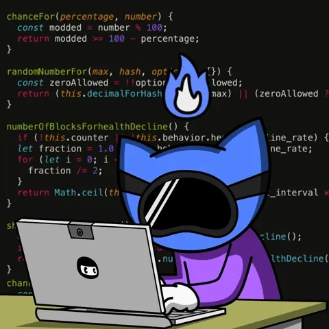
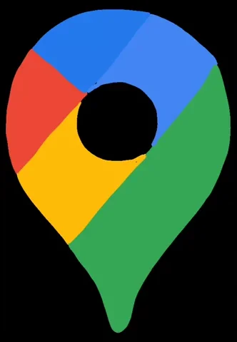

<!-- Pulse divider -->

  

<h1 align="center">
   
  Hi, I am Factor Developer ! 
</h1>

  <strong>Full Stack Web / Mobile Developer 📲 & Cloud / IoT Engineer ☁️</strong>

  
  
  

 

  
  Welcome to my developer profile! I bridge the gap between software systems and physical realities. 
  As an engineering lead, I focus on the seamless integration of Artificial Intelligence, Robotics, and Industrial IoT (IIoT) at <b>AutoNovations</b>. 
  Feel free to explore my interactive profile folders below! 📁

 
 

<!-- Pulse divider -->

  

---

## 📂 System Navigation

  
<b>👤 01_about_me.log</b>

   
  <table>
    <tr>
      <td width="65%" valign="top">
        <h3>🚀 Career Overview & Learning</h3>
        <ul>
          <li>🌐 <b>Full Stack Web & Mobile Developer</b> specializing in robust cross-platform architectures.</li>
          <li>☁️ <b>Cloud Architect</b> with expertise in Google Cloud Platform (GCP), Amazon Web Services (AWS), and Catalyst by Zoho.</li>
          <li>💬 Ask me about <b>Programming, Web development, Android Architecture, Cloud Computing, IoT, and Edge Computing</b>.</li>
          <li>🌱 Currently expanding horizons in <b>Data Science</b> and <b>Artificial Intelligence</b>.</li>
          <li>💼 Hands-on developer of commercial and enterprise-scale mobile apps.</li>
          <li>🤝 Open for freelancing and project collaborations.</li>
        </ul>
      </td>
      <td width="35%" align="center">
        
      </td>
    </tr>
  </table>

  
<b>🛠️ 02_tech_stack.bin</b>

   
  <h3 align="center">
    
    Core Technologies & Skillsets
    
  </h3>
  
  <table>
    <tr>
      <td><b>Web Frontend</b></td>
      <td><code>HTML5</code> <code>CSS3</code> <code>JavaScript</code> <code>JQuery</code> <code>React</code> <code>Bootstrap</code></td>
    </tr>
    <tr>
      <td><b>Backend & APIs</b></td>
      <td><code>Node.js</code> <code>Express</code> <code>PHP</code> <code>Laravel</code> <code>Python</code> <code>Django</code> <code>FastAPI</code> <code>Java</code> <code>Spring Boot</code></td>
    </tr>
    <tr>
      <td><b>Databases</b></td>
      <td><code>MySQL</code> <code>PostgreSQL</code> <code>MongoDB</code> <code>Firebase</code></td>
    </tr>
    <tr>
      <td><b>Mobile Development</b></td>
      <td><code>Kotlin</code> <code>Android Studio</code> <code>Firebase</code></td>
    </tr>
    <tr>
      <td><b>Cloud & DevOps</b></td>
      <td><code>Google Cloud (GCP)</code> <code>AWS</code> <code>Catalyst by Zoho</code> <code>GitHub</code> <code>Linux</code> <code>Ubuntu</code></td>
    </tr>
    <tr>
      <td><b>AI & Data Science</b></td>
      <td><code>Python</code> <code>Anaconda</code> <code>Scikit-Learn</code> <code>TensorFlow</code></td>
    </tr>
    <tr>
      <td><b>IoT & Hardware</b></td>
      <td><code>Arduino</code> <code>Edge Computing</code></td>
    </tr>
  </table>
  
   
  
  

    
  

  
<b>📊 03_github_stats.sys</b>

   
  <h3 align="center">⚡ Real-time GitHub Analytics</h3>
   
  

    
    
  

   
  

    
  

  
<b>🎮 04_activity_board.exe</b>

   
  

    <b>🏆 Contributions Trophy Board</b>
  

  

    
  

   
  

    <b>🐍 Code Activity Snake Game</b>
  

  

    
  

  
<b>🔗 05_portfolio_and_stores.lnk</b>

   
  <table>
    <tr>
      <td width="60%" valign="top">
        <h3>✨ Professional Profiles</h3>
        <ul>
          <li>
            <a href="https://factordeveloper.github.io/Portafolio-Proyectos/" target="_blank">
               <b>Personal Portfolio</b>
            </a>
             Explore my client projects, open-source work, and live demos.
          </li>
           
          <li>
            <a href="https://play.google.com/store/apps/dev?id=6616258522728580660" target="_blank">
               <b>Google Play Console</b>
            </a>
             Check out mobile applications engineered and published by me.
          </li>
           
          <li>
            <a href="https://developers.google.com/profile/u/factor-developer" target="_blank">
               <b>Google Developer Program</b>
            </a>
             Learn about my active participation and profile badge achievements.
          </li>
        </ul>
      </td>
      <td width="40%" align="center">
        
          
        
      </td>
    </tr>
  </table>

  
<b>🤝 06_communication_channels.net</b>

   
  

    
    <b>Let's collaborate on amazing ideas!</b>
    
  

   
  

    
    
    
    
    
    
  

  
<b>📺 07_tutorials_and_videos.mov</b>

   
  
<b>My Featured YouTube Tutorials</b>

   
  <table>
    <tbody>
      <tr>
        <td>
          
        </td>
        <td>
          <a href="https://www.youtube.com/channel/UC-cU2oHg4-hjeI21ov3wn4w" target="_blank">
            <b>How to Create Custom Snippets for Any Language in VS Code</b>
          </a>
           Increase coding speed by defining template macros.
        </td>
      </tr>
      <tr>
        <td>
          
        </td>
        <td>
          <a href="https://www.youtube.com/channel/UC-cU2oHg4-hjeI21ov3wn4w" target="_blank">
            <b>Build a Weather App with HTML, CSS & JavaScript</b>
          </a>
           Integrate public weather APIs and parse geolocation parameters.
        </td>
      </tr>
      <tr>
        <td>
          
        </td>
        <td>
          <a href="https://www.youtube.com/channel/UC-cU2oHg4-hjeI21ov3wn4w" target="_blank">
            <b>Making a Responsive Card with HTML and CSS</b>
          </a>
           Design custom layouts using Flexbox/Grid systems.
        </td>
      </tr>
    </tbody>
  </table>
   
  

    
  

---

  

